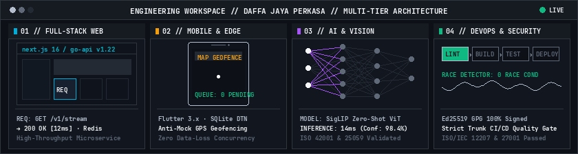
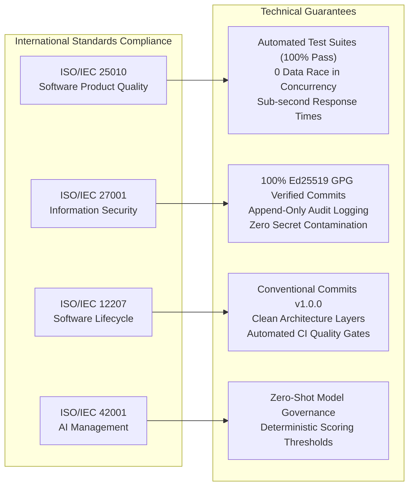

<div align="center">



<br/>

# 👨‍💻 Daffa Jaya Perkasa
### **Full-Stack · Mobile · AI · DevOps Engineer**

📍 Bandung, Indonesia (UTC+7 / WIB) • 👤 he/him • 💼 [LinkedIn](https://linkedin.com/in/dafayape) • 📧 [dafayape@gmail.com](mailto:dafayape@gmail.com)

```
Building resilient, high-performance distributed systems, edge-native applications,
and machine learning pipelines with rigorous Clean Architecture and international ISO standards compliance.
```

[](https://linkedin.com/in/dafayape)
[](#standards-principles)
[](#standards-principles)
[](#standards-principles)
[](#standards-principles)
[](#cryptographic-verification)

</div>

---

## 🧭 About Me

I am a software engineer specializing in architecting end-to-end resilient platforms across four core engineering pillars: **Full-Stack Web**, **Mobile Applications**, **Artificial Intelligence**, and **DevOps Infrastructure**.

My engineering methodology prioritizes:
- **Clean Architecture & Separation of Concerns**: Enforcing explicit boundaries across UI, domain business logic, and infrastructure adapters.
- **Resilience in Constrained Environments**: Crafting low-bandwidth disruption-tolerant edge systems (LoRa, SQLite Store-and-Forward, binary serialization).
- **Cryptographic Trust & Zero Fluff**: 100% GPG-signed commits with verified identity non-repudiation, zero hardcoded credentials, and zero AI co-author pollution.
- **Quality Gates Automation**: Strict CI/CD pipelines enforcing regression testing, race condition detection, and static analysis.

---

## 🛠️ Technical Competencies

| Domain | Mastered Stack & Official Badges | Architecture & Engineering Standards |
|:---|:---|:---|
| **⚡ Backend & Distributed Systems** |      | Gin, Gorilla WebSockets, GORM, Concurrency with Race Detectors, Redis Geospatial, RESTful API Design |
| **🖥️ Frontend & Web Engineering** |     | Next.js 16 (App Router), React 19, Turbopack, Leaflet Maps, Responsive Component Systems, Web Vitals |
| **📱 Mobile & Edge Computing** |    | Flutter 3.x, Riverpod 2.6, BLoC Pattern, Offline Store-and-Forward DTN, LoRa Physical Ether, GPS Geofencing |
| **🧠 Artificial Intelligence & Vision** |    | Google SigLIP ViT, Zero-Shot Classification, Asynchronous Inference Workers, ISO/IEC 42001 & 25059 |
| **📦 DevOps, Security & Cloud** |      | Multi-Stage Builds, CI/CD Automated Quality Gates, POSIX Hardened Shell, Ed25519 GPG Non-Repudiation |

---

## 🚀 Featured Architectural Projects

### 1. 🛡️ SESPIMMA ` ` [](#-standards--engineering-principles)
> **Digital evaluation, anti-spoofing GPS geofence attendance, and cadet tracking platform for police academy institutions.**
- **Stack**: Go (Gin, GORM, Redis), Next.js 16 (React 19), Flutter (Clean Architecture, BLoC Pattern).
- **Key Engineering**: 8-tier RBAC security model, append-only audit trail ledger, multi-aspect evaluation (academic, physical fitness, mental sociometry), anti-mock GPS geofencing via Redis geospatial caching.
- **Compliance**: ISO/IEC 25010 (Quality), ISO/IEC 27001 (Hardened Security), ISO/IEC 12207 (Lifecycle).

### 2. 🌊 [Maritime LoRa Mesh Network Simulator](https://github.com/dafayape/maritime-simulation) ` ` [](https://github.com/dafayape/maritime-simulation)
> **Software-in-the-Loop Maritime Telecommunications, Mesh Routing & Physical Ether Simulator.**
- **Stack**: Go 1.22 (Virtual Ether Engine), Next.js 16 (Harbor Master Dashboard), Flutter (Ship Node Client).
- **Key Engineering**: Physical radio ether simulation, BFS shortest-path dynamic multi-hop routing, Disruption-Tolerant Networking (DTN) via offline transactional SQLite queue, pure binary MessagePack serialization.
- **Compliance**: ISO/IEC 25010, ISO/IEC 27001, ISO/IEC 12207.

### 3. 🤖 Berseka Vision AI ` ` [](#-standards--engineering-principles)
> **Production-grade Vision AI for automated waste classification using Google SigLIP zero-shot model.**
- **Stack**: Python 3.11, FastAPI, PyTorch, Google SigLIP ViT, Docker Multi-Stage.
- **Key Engineering**: Sub-second zero-shot visual inference, asynchronous worker pools, structured confidence scoring matrix, automated quality regression suite.
- **Compliance**: ISO/IEC 42001:2023 (AI Management System) & ISO/IEC 25059:2023 (Quality of AI Systems).

### 4. 🌴 SawitChain ` ` [](#-standards--engineering-principles)
> **Web platform for palm oil supply chain traceability and sustainability monitoring.**
- **Stack**: Next.js 16, React 19, TypeScript, Tailwind CSS, Lucide Icons.
- **Key Engineering**: Enterprise supply chain ledger dashboard, component-driven Clean Architecture, 100% static page pre-rendering via Turbopack.
- **Compliance**: ISO/IEC 25010 & ISO/IEC 27001.

### 5. ⚙️ Dotfiles Hardened Environment ` ` [](#-standards--engineering-principles)
> **Modular Unix environment configurations, developer tooling, and ISO 27001 cryptographic security hardening.**
- **Stack**: Bash 5.x, POSIX Shell, Ed25519 GPG, Git Configuration.
- **Key Engineering**: Modular `.bashrc.d` architecture (15 components), idempotent automated installer, global security ignore policies, SSH keepalive hardening.
- **Compliance**: ISO/IEC 12207 & ISO/IEC 27001.

---

<a id="standards-principles"></a>
## 🛡️ Standards & Engineering Principles



---

<a id="cryptographic-verification"></a>
## 🔐 Cryptographic Verification

All source code contributions across public and private repositories are cryptographically signed to guarantee authenticity and non-repudiation:
- **GPG Key ID**: `7573912AF4141E99`
- **Algorithm**: `Ed25519`
- **Fingerprint**: `63C9 25CD FF6A 5C49 46DA  ACF0 7573 912A F414 1E99`
- **Commit History**: 100% GitHub Verified Badge (`verified: true`)

---

## 📬 Contact & Connect

- **Email**: [dafayape@gmail.com](mailto:dafayape@gmail.com)
- **LinkedIn**: [linkedin.com/in/dafayape](https://linkedin.com/in/dafayape)
- **GitHub**: [@dafayape](https://github.com/dafayape)
- **Location**: Bandung, West Java, Indonesia (UTC+7 / WIB)
- **Pronouns**: he / him
- **Availability**: Open for high-impact Full-Stack, Mobile, AI, and DevOps engineering opportunities.

<div align="center">


<br/>

<sub>Designed and engineered by **Daffa Jaya Perkasa** • Licensed under [MIT](LICENSE)</sub>

</div>
